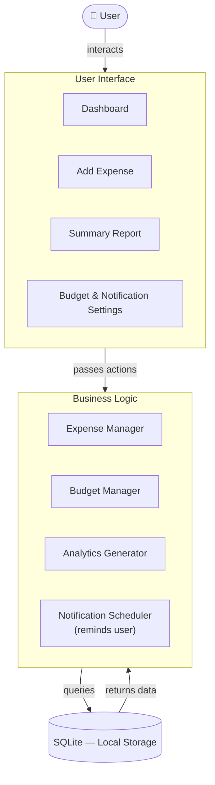

# Fins

Fins is a personal finance tracking application designed for users who want a simple, reliable, and privacy-focused way to manage their finances.

Instead of relying on spreadsheets or manual record-keeping, Fins provides a structured platform for recording expenses, managing budgets, monitoring cash flow, and reviewing financial summaries. All data is stored locally on the device, ensuring complete ownership and privacy of financial information.

---

## Table of Contents

- [Features](#features)
- [Tech Stack](#tech-stack)
- [Setting Up](#setting-up)
  - [Prerequisites](#prerequisites)
  - [Installation](#installation)
  - [Running the Application](#running-the-application)
- [Logical View](#logical-view)
- [Software Architecture](#software-architecture)
- [Project Structure](#project-structure)
- [Authors](#authors)

---

# Features

### Expense Management

Manage expenses through complete CRUD functionality.

- Create, view, update, and delete expense records
- Support for both past and future expenses
- Organize expenses using preset or custom categories
- Maintain a detailed history of financial transactions

### Cash In Recording

Track incoming funds and monitor available spending capacity.

- Record cash inflows and additional income sources
- Automatically update remaining budget allocations

### Receipt Scanner

Digitize expense entries with OCR-assisted receipt processing.

- Capture receipts using the device camera
- Import receipts directly from the gallery
- Automatically extract and populate expense information

### Budget Management & Notifications

Stay within financial limits through budgeting tools and reminders.

- Create and modify budget limits
- Configure personalized notification schedules
- Receive reminders for financial activities and deadlines

### Summary Reports

Visualize and review spending patterns over time.

- Weekly and monthly financial summaries
- Historical expense browsing
- Spending comparisons across different periods

### Financial Insights

Receive AI-powered spending analysis without requiring an internet connection.

- Fully offline financial analysis
- Personalized spending observations
- Actionable recommendations for improving financial habits

### Theme Customization

Personalize the application's appearance.

- Multiple built-in themes
- Customizable user experience

### Privacy-First Design

All information remains on the user's device.

- No account creation required
- No cloud synchronization
- No internet connection required
- Local SQLite storage

---

# Tech Stack

Fins is built using Flutter and local storage technologies to provide a fully offline experience.

| Technology | Purpose |
|------------|----------|
| **Flutter** | Cross-platform mobile application development |
| **SQLite** | Local data persistence |
| **Android Notification System** | Scheduled reminders and alerts |

---

# Setting Up

## Prerequisites

Before running the project, ensure the following tools are installed:

| Tool | Download |
|------|----------|
| Flutter SDK | https://docs.flutter.dev/get-started/install |
| Git | https://git-scm.com/downloads |
| IDE | Visual Studio Code or Android Studio |

---

## Installation

### 1. Clone the Repository

```bash
git clone https://github.com/Fins-Financial-Tracker/CMSC128_FinTracker
cd CMSC128_FinTracker
```

### 2. Verify Flutter Installation

```bash
flutter doctor
```

Resolve any issues reported before proceeding.

### 3. Install Dependencies

```bash
flutter pub get
```

---

## Running the Application

#### Option A — Android APK

**1. Navigate to the project root**

```bash
cd CMSC128_FinTracker
```

**2. Build the APK**

```bash
flutter build apk --release
```

**3. Locate the APK**

The APK will be generated at:

```
android/app/build/outputs/apk/release/app-release.apk
```
**4. Install on physical device**

  - Manual Installation

    Transfer the APK through USB, cloud storage, or file-sharing services. Open the APK on the device and allow installation from unknown sources when prompted.

    OR

  - ADB Installation

```bash
adb install build/app/outputs/flutter-apk/app-arm64-v8a-release.apk
```

---

### Option B — Windows Desktop

#### 1. Install Visual Studio 2022

Install Visual Studio with:

- Desktop development with C++
- Default recommended components

#### 2. Enable Developer Mode

Navigate to:

**Settings → Privacy & Security → For Developers**

Enable **Developer Mode**.

#### 3. Enable Windows Desktop Support

```bash
flutter config --enable-windows-desktop
```

#### 4. Run the Application

```bash
flutter run -d windows
```

---

### Option C — Android Emulator

#### 1. Install Android Studio

Download and install Android Studio.

#### 2. Create a Virtual Device

1. Open **Tools → Device Manager**
2. Select **Create Device**
3. Choose a device profile
4. Download a system image (API 34+ recommended)
5. Launch the emulator

#### 3. Verify Device Detection

```bash
flutter devices
```

#### 4. Run the Application

```bash
flutter run
```

---

# Logical View

Fins follows a layered architecture composed of the User Interface, Business Logic, and Data Storage layers.



## Flow Description

1. The **User** interacts with the application through the UI layer.
2. User actions are forwarded to the **Business Logic Layer** for processing and validation.
3. Managers compute summaries, handle categories, and manage budgets.
4. The **Data Layer** stores and retrieves records using SQLite.
5. The **Notification Scheduler** triggers reminders that are surfaced back to the user.

This separation improves maintainability and clearly defines how system components interact with one another.

---

# Software Architecture

Fins follows an **MVC-inspired layered architecture**. There is no dedicated state management library — UI screens in `pages/` handle display, interact directly with the SQLite database layer, and contain most of the business logic. This is a common starting structure for Flutter apps.

| Layer | Implementation | Responsibility |
|---|---|---|
| **Model** | `expense_model.dart` + `db_helper.dart` | Data structures and database operations |
| **View** | Flutter page widgets in `pages/` | UI screens and user interaction |
| **Controller** | Logic inside page widgets | Business logic, filtering, and state handling (not yet formally separated) |

### Current Limitations
 
- Business logic is mixed into View pages rather than isolated in dedicated controllers
- No formal state management solution (e.g. Provider, Riverpod, GetX) is currently used
- Database calls are made directly from page widgets

### Planned Improvements
 
A future refactor aims to properly separate concerns by introducing dedicated controller and service layers, and adopting a state management solution for cleaner data flow between components.

---

## Project Structure
 
```
CMSC128_FinTracker/
├── android/                            # Android platform code
├── assets/
│   ├── fonts/
│   └── images/
├── ios/                                # iOS platform code
├── lib/
│   ├── analytics/                      # Financial insights logic
│   ├── database/
│   │   └── db_helper.dart              # SQLite database operations
│   ├── pages/
│   │   ├── builders/                   # Widget builders
│   │   ├── expenses/                   # Expense-related screens
│   │   ├── summary_helpers/            # Summary calculation helpers
│   │   ├── summary_widgets/            # Summary UI widgets
│   │   ├── customizations.dart         # Settings/customization screen
│   │   ├── edit_page.dart              # Edit expense screen
│   │   ├── expense_model.dart          # Expense data model
│   │   ├── finance_insights.dart       # Financial insights screen
│   │   ├── homepage.dart               # Main dashboard
│   │   ├── landing.dart                # Landing/splash screen
│   │   ├── monthly_view.dart           # Monthly view screen
│   │   ├── settings_page.dart          # Settings screen
│   │   └── summary.dart                # Summary/reports screen
│   ├── themes/                         # App theme definitions
│   └── utils/                          # Utility/helper functions
│   └── main.dart                       # Entry point
├── linux/
├── macos/
├── web/
├── windows/
└── pubspec.yaml                        # Package dependencies
```

### Layer Mapping
 
**Model** — Data & Persistence
 
| File | Component | Responsibility |
|---|---|---|
| `lib/database/db_helper.dart` | DBHelper | Database initialization, CRUD operations |
| `lib/pages/expense_model.dart` | Expense class | Expense data structure and mapping |
 
**View** — User Interface
 
| File | Component | Responsibility |
|---|---|---|
| `lib/pages/landing.dart` | LandingPage | Splash/onboarding screen |
| `lib/pages/homepage.dart` | HomePage | Main dashboard and expense list |
| `lib/pages/edit_page.dart` | EditPage | Expense creation and editing |
| `lib/pages/summary.dart` | SummaryPage | Reports and analytics |
| `lib/pages/monthly_view.dart` | MonthlyView | Monthly expense view |
| `lib/pages/finance_insights.dart` | FinanceInsights | Financial insights screen |
| `lib/pages/customizations.dart` | CustomizationsPage | User preferences and settings |
| `lib/pages/settings_page.dart` | SettingsPage | App settings |
 
**Controller** — Business Logic *(mixed into page widgets)*
 
| File | Component | Responsibility |
|---|---|---|
| `lib/pages/expenses/` | Expense widgets | Expense loading, filtering, state handling |
| `lib/pages/summary_helpers/` | Summary helpers | Summary calculations |
| `lib/analytics/` | Analytics logic | Financial insights processing |
| `lib/utils/` | Utilities | Notification scheduling and helpers |
 
---

# Authors

<div align="center">

| Team Members |
|-------------|
| Andrea Laserna |
| Sam Lansoy |
| Marinelle Joan Tambolero |
| Michaela Borces |
| Christel Hope Ong |
| Sophe Mae Dela Cruz |

</div>

---

<p align="center">
  Built as a CMSC 128 Software Engineering Project
</p>
